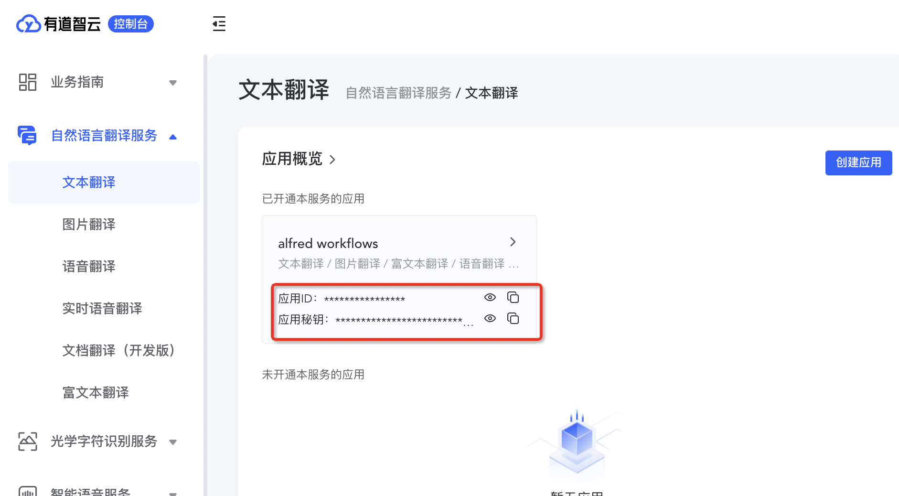
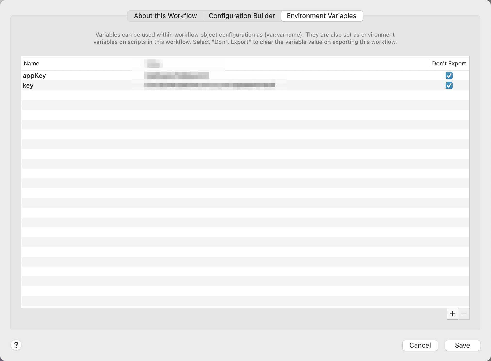
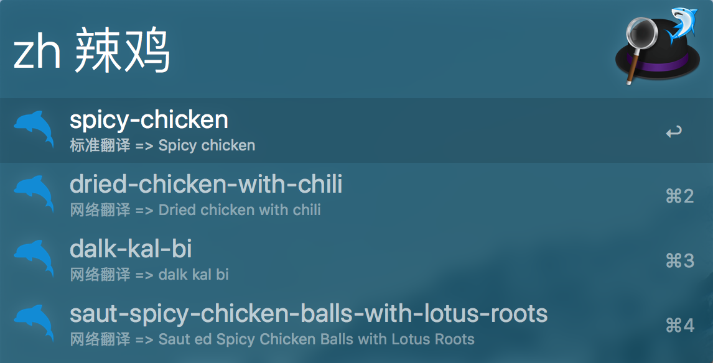

# CodeVar

fork 自 xudaolong 的 CodeVar
https://github.com/xudaolong/CodeVar

开发基于 `Javascript`、 `alfy`、`有道翻译api`;

# 调整

修复了 xudaolong/CodeVar 旧版本有道 API 无法使用问题

# 使用

1. 创建有道云 API
   https://ai.youdao.com/console/#/service-singleton/text-translation

2. 获取应用 id 和应用密钥
   

3. 配置 workflow 环境变量（key 为应用密钥，appKey 为应用 id）
   

4. 开始使用

# 依赖

-   Node.js 8+
-   Alfred 3

# 安装

[点击下载](https://github.com/liuarui/CodeVar/releases)

# 开发趋向

-   使用标准的缩写（如 rpt）。✔️
-   去掉虚词 and,or,the。✔️
-   使用名字中的每一个重要单词，最多不超过 3 个。❎
-   去掉无用的后缀（如 ing、ed 等）。❎
-   确保不要改变变量的含义。✔️
-   不要从每个单词中删除一个字符的方式来缩写。❎
-   缩写要一致：如果将 function 缩写成 func。那么将整个项目里，最好都统一使用这种缩写。✔️

# 效果

> 小驼峰命名法:xt

> 大驼峰命名法:dt

> 下划线命名法:xh

> 常量命名法:cl

> 中划线命名法:zh

