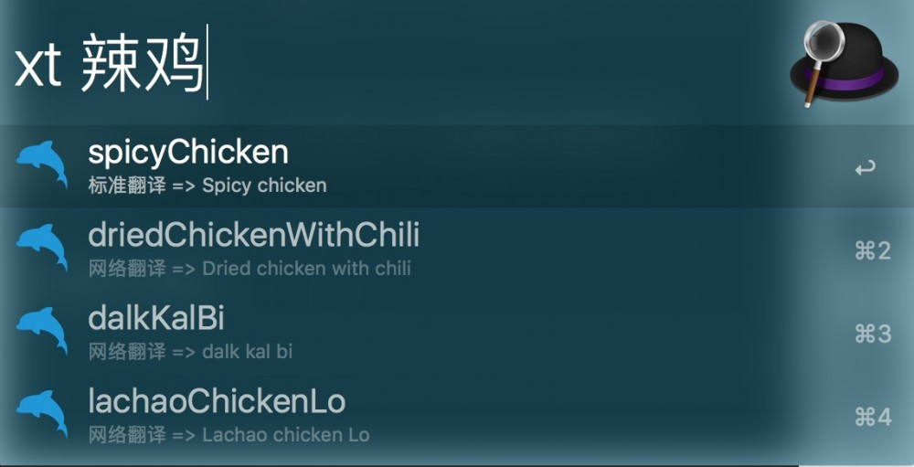
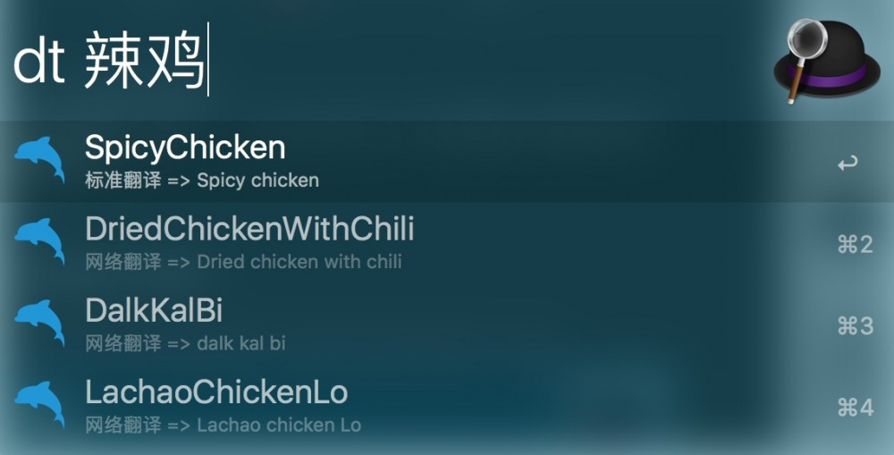
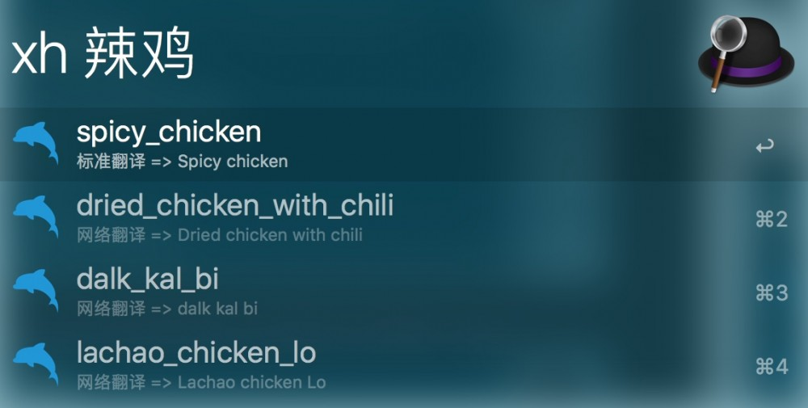
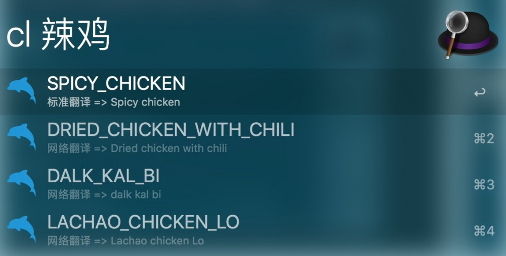

# CodeVar
开发基于 `Javascript`、 `alfy`、`有道翻译api`;

# 依赖
- Node.js 8+
- Alfred 3 

# 安装
[点击下载](https://github.com/xudaolong/CodeVar/releases)

# 开发趋向

- 使用标准的缩写（如 rpt）。✔️
- 去掉虚词 and,or,the。✔️
- 使用名字中的每一个重要单词，最多不超过3个。❎
- 去掉无用的后缀（如 ing、ed 等）。❎
- 确保不要改变变量的含义。✔️
- 不要从每个单词中删除一个字符的方式来缩写。❎
- 缩写要一致：如果将 function 缩写成 func。那么将整个项目里，最好都统一使用这种缩写。✔️

# 效果 
> 小驼峰命名法:xt

> 大驼峰命名法:dt

> 下划线命名法:xh

> 常量命名法:cl

# 作者
关注作者有更多好用的小工具哦~

# 其他作品

[CodeExpander](https://github.com/oncework/codeexpander) 专为开发者开发的一个集输入增强、代码片段管理(支持 Markdown)为一体跨平台云同步的开发工具。